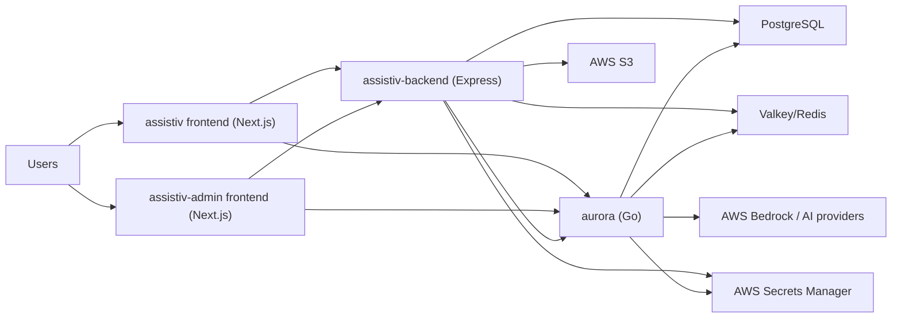

The Assistiv platform is split across two frontends and two backend services.

## Runtime Flow

## Service Responsibilities

| Service | Responsibility |
| --- | --- |
| `assistiv` | Student and tenant-admin product UI, including auth, course workflows, study tools, and spaces UX. |
| `assistiv-admin` | System-level administration UI: users, enterprise/subdomain setup, deployment and model usage views. |
| `assistiv-backend` | Main API, auth/session flow, course/group/content management, logging, system admin controls. |
| `aurora` | AI-centric capabilities and study/space intelligence endpoints under `/aurora/v1`. |

## Ports and Local URLs

| Service | Local URL (expected) | Notes |
| --- | --- | --- |
| `assistiv` | `https://127.0.0.1:4200` | Makefile runs Next with HTTPS and port `4200`. |
| `assistiv-admin` | `https://127.0.0.1:4200` by default | Conflicts with `assistiv` if both run unchanged. |
| `assistiv-backend` | `https://127.0.0.1:3000` in dev mode | Uses TLS in development when `NODE_ENV=development`. |
| `aurora` | `https://127.0.0.1:3001/aurora/v1` in dev mode | Base API prefix is `/aurora/v1`. |

## Important Integration Note

Both frontends can call the backend API and Aurora API separately. In production, Aurora is commonly referenced at `https://backend.useassistiv.com/aurora/v1/...`, which suggests gateway or reverse-proxy path routing in deployed infrastructure.
